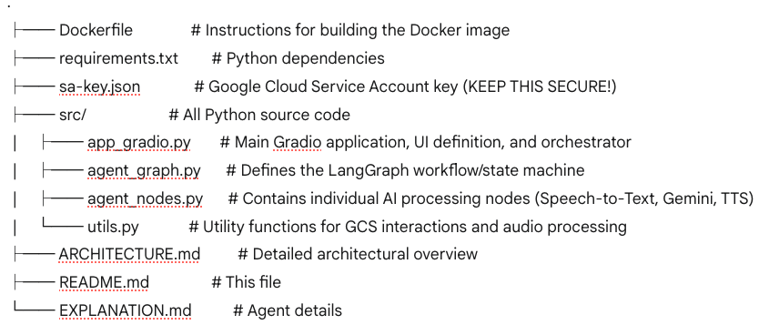

# 🗣️ AI Public Speaking Coach

This project provides an AI-powered public speaking coach that analyzes video recordings and offers personalized textual and audio feedback. It leverages Google Cloud's advanced AI services (Speech-to-Text, Gemini, Text-to-Speech) and is built with Python, LangGraph for orchestration, and Gradio for the user interface.

## ✨ Features

* **Video Upload/Recording:** Easily upload a video file or record directly from your webcam.
* **Speech Transcription:** Automatically transcribes spoken content from your video.
* **AI-Powered Feedback:** Generates constructive feedback on your public speaking, including strengths and areas for improvement, using Google Gemini.
* **Audio Feedback:** Provides a synthesized audio version of the feedback for convenient listening.
* **Mobile-Friendly UI:** A clean and responsive user interface built with Gradio, designed to work well on mobile devices.
* **Containerized Deployment:** Ready for deployment as a Docker container for easy portability and scaling.

## 🚀 Architecture Overview

The application operates with a Gradio frontend serving as the user interface and orchestrator. It interacts with various Google Cloud services (Speech-to-Text, Gemini, Text-to-Speech) for core AI functionalities. A LangGraph agent manages the multi-step workflow, and Google Cloud Storage is used for temporary file handling.

For a detailed architectural breakdown, please refer to the [ARCHITECTURE.md](ARCHITECTURE.md) file.

## 📋 Prerequisites

Before you begin, ensure you have the following installed and configured:

1.  **Python 3.12:**
    * Download from [python.org](https://www.python.org/downloads/).
    * It's recommended to use a virtual environment (e.g., `venv` or `conda`).
2.  **Docker Desktop:**
    * Download and install from [docker.com/products/docker-desktop](https://www.docker.com/products/docker-desktop/).
    * Ensure Docker is running and the `docker` command is accessible in your terminal (`docker --version`).
3.  **Google Cloud Project:**
    * An active Google Cloud Project. If you don't have one, create one at [console.cloud.google.com](https://console.cloud.google.com/).
    * **Billing Enabled:** Ensure billing is enabled for your project (required for using Google Cloud APIs).
4.  **FFmpeg:**
    * FFmpeg is essential for audio extraction from videos. It's pre-installed in the Docker image, but if you run parts of the code locally without Docker, you'll need it.
    * **macOS:** `brew install ffmpeg`
    * **Windows:** Download from [ffmpeg.org/download.html](https://ffmpeg.org/download.html) and add to PATH.
    * **Linux:** `sudo apt-get install ffmpeg` (Debian/Ubuntu) or `sudo yum install ffmpeg` (CentOS/RHEL).

## ⚙️ Google Cloud Setup

Follow these steps to configure your Google Cloud Project:

### 1. Enable Required APIs

Navigate to **APIs & Services > Library** in your Google Cloud Console and enable the following APIs:

* **Cloud Speech-to-Text API**
* **Cloud Text-to-Speech API**
* **Vertex AI API** (for Google Gemini)
* **Cloud Storage API**

### 2. Create a Google Cloud Storage Bucket

This bucket will be used for temporary storage of video uploads, extracted audio, and synthesized feedback audio.

* Go to **Cloud Storage > Buckets** in your Google Cloud Console.
* Click **"CREATE BUCKET"**.
* Choose a unique name (e.g., `your-public-speaking-coach-bucket`).
* Select a region and other desired settings.
* Click **"CREATE"**.

### 3. Create a Service Account and Generate Key

This service account will be used by your Docker container to authenticate with Google Cloud services.

* Go to **IAM & Admin > Service Accounts** in your Google Cloud Console.
* Click **"+ CREATE SERVICE ACCOUNT"**.
* Give it a name (e.g., `public-speaking-coach-sa`) and an optional description. Click **"DONE"**.
* **Grant Roles to the Service Account:**
    * Click on the newly created service account's email address.
    * Go to the **"PERMISSIONS"** tab.
    * Click **"GRANT ACCESS"** (or "ADD PRINCIPAL").
    * In the "New principals" field, enter the email address of the service account you just created.
    * Add the following roles:
        * `Storage Object Admin`
        * `Speech-to-Text User`
        * `Vertex AI User`
        * `Editor` (This broad role is used as a workaround for Text-to-Speech permissions, which can be elusive. For production, consider more granular custom roles if you can identify them.)
    * Click **"SAVE"**.
* **Generate JSON Key:**
    * Back on the "Service Accounts" page, click the three dots (`...`) under the "Actions" column for your new service account.
    * Select **"Manage keys"**.
    * Click **"ADD KEY" > "Create new key"**.
    * Choose **"JSON"** as the key type and click **"CREATE"**.
    * **A JSON file will be downloaded.** Rename this file to `sa-key.json` and place it in the root directory of your project (where `Dockerfile` is located). **Keep this file secure and do not commit it to version control.**

### 4. Update Configuration Files

* **`utils.py`**:
    * Open `utils.py`.
    * Update the `GCS_BUCKET_NAME` variable to match the exact name of the Google Cloud Storage bucket you created:
        ```python
        GCS_BUCKET_NAME = "your-public-speaking-coach-bucket" # <<< IMPORTANT: Update this
        ```
* **`agent_nodes.py`**:
    * Open `agent_nodes.py`.
    * Update `GCP_PROJECT_ID` with your actual Google Cloud Project ID.
    * Update `GOOGLE_API_KEY` with an API key generated from Google Cloud Console (APIs & Services -> Credentials -> Create Credentials -> API Key). This is primarily for Gemini access in some setups, though the service account credentials will also cover it. **Do not commit this key to version control.**
        ```python
        GCP_PROJECT_ID = "your-google-cloud-project-id" # <<< Update this
        GOOGLE_API_KEY = "YOUR_GENERATED_GEMINI_API_KEY_HERE" # <<< PASTE YOUR API KEY HERE
        ```

## 🏃‍♀️ Running the Application

Once all prerequisites and Google Cloud setups are complete, you can run the application using Docker.

1.  **Navigate to Project Root:**
    Open your terminal and change the directory to the root of your project (where `Dockerfile`, `requirements.txt`, and your Python scripts are located).

2.  **Build the Docker Image:**
    This command reads your `Dockerfile` and `requirements.txt` to create a Docker image.
    ```bash
    docker build -t public-speaking-coach .
    ```
    This might take a few minutes on the first run as it downloads base images and installs dependencies.

3.  **Run the Docker Container:**
    This command starts your Gradio application inside the Docker container and maps the necessary ports, providing your service account key for Google Cloud authentication.
    ```bash
    docker run -p 7860:7860 \
      -v "$(pwd)/sa-key.json:/app/sa-key.json" \
      -e GOOGLE_APPLICATION_CREDENTIALS="/app/sa-key.json" \
      public-speaking-coach
    ```
    * The `-v` flag mounts your `sa-key.json` file from your host machine into the container.
    * The `-e` flag sets the `GOOGLE_APPLICATION_CREDENTIALS` environment variable inside the container, pointing to the mounted key file.

4.  **Access the UI:**
    After running the `docker run` command, you should see output in your terminal indicating that Gradio is launching. Open your web browser and navigate to:
    ```
    [http://127.0.0.1:7860](http://127.0.0.1:7860)
    ```
    You should now see the AI Public Speaking Coach UI.

## 📂 Project Structure



## 🤝 Contributing

Contributions are welcome! Please feel free to open issues or submit pull requests.

## 📄 License

[Specify your project's license here, e.g., MIT, Apache 2.0]
